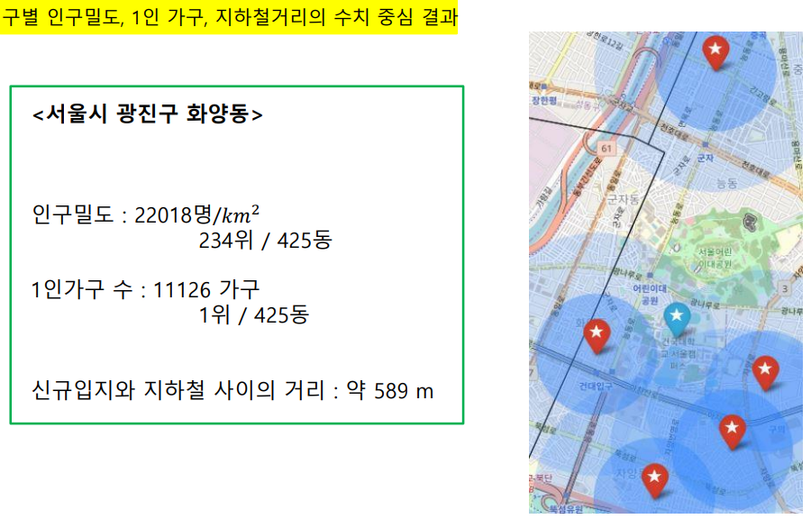

# project3_kyochon-location-selection
## '교촌치킨' 신규 가맹점 입지 추천 프로젝트

## 주제
- 코로나로 인해 배달시장의 규모가 커졌고 그 중 치킨은 특히 배달의 수요가 많아 계속된 성장세가 이어질 것으로 전망함
- 그 중에서도 국내 치킨시장에서 꾸준히 5대 브랜드로 남아있는 `교촌치킨`에 대해서 새로운 매장 입지선정을 예측해보기로 함
- 위 프로젝트는 4인의 팀 프로젝트로 진행됨

## 목표
다양한 데이터를 통해 교촌치킨의 서울내의 `신규 가맹점의 입지를 선정`   

## 진행과정
- 가맹점의 입지를 선정하기 위한 **데이터 수집**
    - 각 가맹점에 대한 임대료, 유동인구, 경쟁업체간의 거리, 근접 지하철수와 같은 다양한 데이터를 수집 및 전처리 (**총 22개의 데이터**)
    - 수집 데이터 중에서 행정동, 구 단위의 데이터에 대해서는 각 지점별로 분석하기 위해 지점별 배달가능 지역(2km이내)을 `가중치로 이용`해 사용함

- 다중회귀분석을 이용한 **분석**
    - 다중회귀분석을 이용해서 배달의 민족에 나타난 각 지점의 4월과 5월의  리뷰 평균수를 이용해  `**다음달의 평균 리뷰수를 예측**`
    - 분석을 통해 나타난 모형은 **`AIC기준 전진선택법`**이며, 유의하게 사용 변수는 인구밀도, 1인가구의 수, 최근접지하철의 거리가 사용됨

- 분석 결과를 이용한 **결론**
    - 위를 통해 예측한 값을 `질량중심을 이용`해 신규 가맹점의 입지를 선정함
        
        즉, 정규화된 인구밀도, 1인가구, 지하철의 거리를 이용해 2차원의 평면에서의 세 수치의 중심을 구함(2차원 평면에서의 질량중심의 공식을 이용 $(\frac{\sum_am_ax_a}{\sum_am_a},\frac{\sum_am_ay_a}{\sum_am_a})$)
    - 예측한 새로운 지점의 위치
           

## 이용 데이터
- 교촌치킨의 홈페이지에서 서울시의 지점에 대한 위치와 지점명을 스크래핑을 통해 수집 (경쟁업체도 동일하게 수집)
- 배달의 민족의 리뷰수를 직접 수집
- 경쟁업체와의 거리, 근접지하쳘의 수, 지하철역과의 거리같은 지리적 데이터는 카카오지도 API를 이용해 수집
- 인구통계(출생 및 사망, 인구밀도, 가구수 등등)에 대해서는 '서울시 열린데이터 광장'에서 사용
- 지역별 평균 임대료에 대해서는 '서울시 우리마을가게 상권분석서비스'를 이용해 수집